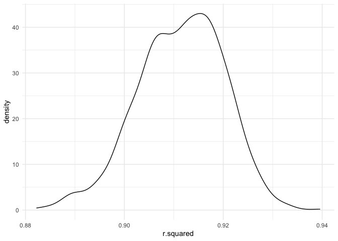
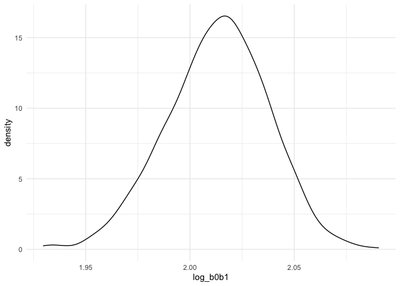

p8105_hw6_yh3554
================

## Problem 1

To obtain a distribution for $\hat{r}^2$, we’ll follow basically the
same procedure we used for regression coefficients: draw bootstrap
samples; the a model to each; extract the value I’m concerned with; and
summarize. Here, we’ll use `modelr::bootstrap` to draw the samples and
`broom::glance` to produce `r.squared` values.

``` r
weather_df = 
  rnoaa::meteo_pull_monitors(
    c("USW00094728"),
    var = c("PRCP", "TMIN", "TMAX"), 
    date_min = "2017-01-01",
    date_max = "2017-12-31") %>%
  mutate(
    name = recode(id, USW00094728 = "CentralPark_NY"),
    tmin = tmin / 10,
    tmax = tmax / 10) %>%
  select(name, id, everything())
```

    ## Registered S3 method overwritten by 'hoardr':
    ##   method           from
    ##   print.cache_info httr

    ## using cached file: ~/Library/Caches/R/noaa_ghcnd/USW00094728.dly

    ## date created (size, mb): 2022-09-08 10:21:49 (8.397)

    ## file min/max dates: 1869-01-01 / 2022-09-30

``` r
weather_df %>% 
  modelr::bootstrap(n = 1000) %>% 
  mutate(
    models = map(strap, ~lm(tmax ~ tmin, data = .x) ),
    results = map(models, broom::glance)) %>% 
  select(-strap, -models) %>% 
  unnest(results) %>% 
  ggplot(aes(x = r.squared)) + geom_density()
```

<!-- -->

In this example, the $\hat{r}^2$ value is high, and the upper bound at 1
may be a cause for the generally skewed shape of the distribution. If we
wanted to construct a confidence interval for $R^2$, we could take the
2.5% and 97.5% quantiles of the estimates across bootstrap samples.
However, because the shape isn’t symmetric, using the mean +/- 1.96
times the standard error probably wouldn’t work well.

We can produce a distribution for $\log(\beta_0 * \beta1)$ using a
similar approach, with a bit more wrangling before we make our plot.

``` r
weather_df %>% 
  modelr::bootstrap(n = 1000) %>% 
  mutate(
    models = map(strap, ~lm(tmax ~ tmin, data = .x) ),
    results = map(models, broom::tidy)) %>% 
  select(-strap, -models) %>% 
  unnest(results) %>% 
  select(id = `.id`, term, estimate) %>% 
  pivot_wider(
    names_from = term, 
    values_from = estimate) %>% 
  rename(beta0 = `(Intercept)`, beta1 = tmin) %>% 
  mutate(log_b0b1 = log(beta0 * beta1)) %>% 
  ggplot(aes(x = log_b0b1)) + geom_density()
```

<!-- -->

As with $r^2$, this distribution is somewhat skewed and has some
outliers.

The point of this is not to say you should always use the bootstrap –
it’s possible to establish “large sample” distributions for strange
parameters / values / summaries in a lot of cases, and those are great
to have. But it is helpful to know that there’s a way to do inference
even in tough cases.

## Problem 2

#### Read the data

``` r
homicide_df = read_csv("data_homicide/homicide-data.csv", show_col_types = FALSE)
```

#### Table of proportion of missing data

``` r
homicide_df %>% 
  summarise_at(vars(lat:disposition), .funs = function(x) mean(is.na(x))) %>%
  knitr::kable()
```

|       lat |       lon | disposition |
|----------:|----------:|------------:|
| 0.0011499 | 0.0011499 |           0 |

#### Describle the raw data

The `homicide_df` is data contains homicides in 50 large U.S. It has
52179 variables and 12 cases. The key variables are unique id, victim
demographic information (first name, last name, age, sex), the location
(city, state, latitude, longitude), and disposition. It has 60 missing
latitude information and 60 missing longitude information.

#### Generate new variables

Create a city_state variable, and a binary variable indicating whether
the homicide is solved. Also omit cities Dallas, TX; Phoenix, AZ; and
Kansas City, MO (these don’t report victim race), and Tulsa, AL (a data
entry mistake). Limit analysis those for whom victim_race is white or
black. Be sure that victim_age is numeric. Cannot convert victim_age to
numeric variable since there is unknown age, so drop the unknown, then
use `as.numeric` to convert it. \* victim_sex: male, female, unknown \*
resolved: homicide case status whether it is solved

``` r
homicide_df_new <- homicide_df %>%
  filter(!victim_age == "Unknown", 
         victim_race == "White" | victim_race == "Black") %>%
  mutate(victim_age = as.numeric(victim_age),
         city_state = str_c(city, state, sep = ", "),
         resolved = as.numeric(disposition == "Closed by arrest")) %>%
  filter(!city_state == "Dallas, TX", !city_state == "Phoenix, Ax", 
         !city_state == "Kansas City, MO", !city_state == "Tulsa, AL") %>%
  mutate(victim_race = as.factor(victim_race),
         victim_sex = factor(victim_sex, level = c("Male", "Female", "Unknown")))

head(homicide_df_new)
```

    ## # A tibble: 6 × 14
    ##   uid    repor…¹ victi…² victi…³ victi…⁴ victi…⁵ victi…⁶ city  state   lat   lon
    ##   <chr>    <dbl> <chr>   <chr>   <fct>     <dbl> <fct>   <chr> <chr> <dbl> <dbl>
    ## 1 Alb-0…  2.01e7 SATTER… VIVIANA White        15 Female  Albu… NM     35.1 -107.
    ## 2 Alb-0…  2.01e7 MULA    VIVIAN  White        72 Female  Albu… NM     35.1 -107.
    ## 3 Alb-0…  2.01e7 BOOK    GERALD… White        91 Female  Albu… NM     35.2 -107.
    ## 4 Alb-0…  2.01e7 MARTIN… GUSTAVO White        56 Male    Albu… NM     35.1 -107.
    ## 5 Alb-0…  2.01e7 GRAY    STEFAN… White        43 Female  Albu… NM     35.1 -107.
    ## 6 Alb-0…  2.01e7 DAVID   LARRY   White        52 Male    Albu… NM     NA     NA 
    ## # … with 3 more variables: disposition <chr>, city_state <chr>, resolved <dbl>,
    ## #   and abbreviated variable names ¹​reported_date, ²​victim_last, ³​victim_first,
    ## #   ⁴​victim_race, ⁵​victim_age, ⁶​victim_sex

``` r
summary(homicide_df_new)
```

    ##      uid            reported_date      victim_last        victim_first      
    ##  Length:39403       Min.   :20070101   Length:39403       Length:39403      
    ##  Class :character   1st Qu.:20100410   Class :character   Class :character  
    ##  Mode  :character   Median :20130112   Mode  :character   Mode  :character  
    ##                     Mean   :20124407                                        
    ##                     3rd Qu.:20150919                                        
    ##                     Max.   :20171231                                        
    ##                                                                             
    ##  victim_race     victim_age       victim_sex        city          
    ##  Black:33130   Min.   :  0.00   Male   :33532   Length:39403      
    ##  White: 6273   1st Qu.: 22.00   Female : 5830   Class :character  
    ##                Median : 28.00   Unknown:   41   Mode  :character  
    ##                Mean   : 31.93                                     
    ##                3rd Qu.: 40.00                                     
    ##                Max.   :102.00                                     
    ##                                                                   
    ##     state                lat             lon          disposition       
    ##  Length:39403       Min.   :25.73   Min.   :-122.51   Length:39403      
    ##  Class :character   1st Qu.:35.04   1st Qu.: -90.26   Class :character  
    ##  Mode  :character   Median :38.90   Median : -86.85   Mode  :character  
    ##                     Mean   :37.54   Mean   : -88.85                     
    ##                     3rd Qu.:40.67   3rd Qu.: -80.83                     
    ##                     Max.   :45.05   Max.   : -71.01                     
    ##                     NA's   :42      NA's   :42                          
    ##   city_state           resolved    
    ##  Length:39403       Min.   :0.000  
    ##  Class :character   1st Qu.:0.000  
    ##  Mode  :character   Median :0.000  
    ##                     Mean   :0.488  
    ##                     3rd Qu.:1.000  
    ##                     Max.   :1.000  
    ## 

#### Logistic regression model for city of Baltimore, MD

Use `glm` function to fit a logistic regression model  
model setup:  
dependent variable: status solved or unsolved  
predictors: victim age, victim sex, victim race  
  

``` r
baltimore_glm <- homicide_df_new %>%
  filter(city_state == "Baltimore, MD") %>%
  select(resolved, victim_age, victim_race, victim_sex) %>%
  glm(resolved ~ victim_age + victim_sex + victim_race, data = ., family = binomial(link = "logit"))

save(baltimore_glm, file = "baltimore_glm.RData")
```
