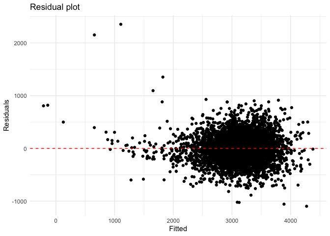

p8105_hw6_yh3554
================

## Problem 1

To obtain a distribution for $\hat{r}^2$, we’ll follow basically the
same procedure we used for regression coefficients: draw bootstrap
samples; the a model to each; extract the value I’m concerned with; and
summarize. Here, we’ll use `modelr::bootstrap` to draw the samples and
`broom::glance` to produce `r.squared` values.

``` r
weather_df = 
  rnoaa::meteo_pull_monitors(
    c("USW00094728"),
    var = c("PRCP", "TMIN", "TMAX"), 
    date_min = "2017-01-01",
    date_max = "2017-12-31") %>%
  mutate(
    name = recode(id, USW00094728 = "CentralPark_NY"),
    tmin = tmin / 10,
    tmax = tmax / 10) %>%
  select(name, id, everything())
```

    ## Registered S3 method overwritten by 'hoardr':
    ##   method           from
    ##   print.cache_info httr

    ## using cached file: ~/Library/Caches/R/noaa_ghcnd/USW00094728.dly

    ## date created (size, mb): 2022-09-08 10:21:49 (8.397)

    ## file min/max dates: 1869-01-01 / 2022-09-30

``` r
weather_df %>% 
  modelr::bootstrap(n = 1000) %>% 
  mutate(
    models = map(strap, ~lm(tmax ~ tmin, data = .x) ),
    results = map(models, broom::glance)) %>% 
  select(-strap, -models) %>% 
  unnest(results) %>% 
  ggplot(aes(x = r.squared)) + geom_density()
```

<!-- -->

In this example, the $\hat{r}^2$ value is high, and the upper bound at 1
may be a cause for the generally skewed shape of the distribution. If we
wanted to construct a confidence interval for $R^2$, we could take the
2.5% and 97.5% quantiles of the estimates across bootstrap samples.
However, because the shape isn’t symmetric, using the mean +/- 1.96
times the standard error probably wouldn’t work well.

We can produce a distribution for $\log(\beta_0 * \beta1)$ using a
similar approach, with a bit more wrangling before we make our plot.

``` r
weather_df %>% 
  modelr::bootstrap(n = 1000) %>% 
  mutate(
    models = map(strap, ~lm(tmax ~ tmin, data = .x) ),
    results = map(models, broom::tidy)) %>% 
  select(-strap, -models) %>% 
  unnest(results) %>% 
  select(id = `.id`, term, estimate) %>% 
  pivot_wider(
    names_from = term, 
    values_from = estimate) %>% 
  rename(beta0 = `(Intercept)`, beta1 = tmin) %>% 
  mutate(log_b0b1 = log(beta0 * beta1)) %>% 
  ggplot(aes(x = log_b0b1)) + geom_density()
```

<!-- -->

As with $r^2$, this distribution is somewhat skewed and has some
outliers.

The point of this is not to say you should always use the bootstrap –
it’s possible to establish “large sample” distributions for strange
parameters / values / summaries in a lot of cases, and those are great
to have. But it is helpful to know that there’s a way to do inference
even in tough cases.

## Problem 2

#### Read the data

``` r
homicide_df = read_csv("data_homicide/homicide-data.csv", show_col_types = FALSE)
```

#### Table of proportion of missing data

``` r
homicide_df %>% 
  summarise_at(vars(lat:disposition), .funs = function(x) mean(is.na(x))) %>%
  knitr::kable()
```

|       lat |       lon | disposition |
|----------:|----------:|------------:|
| 0.0011499 | 0.0011499 |           0 |

#### Describle the raw data

The `homicide_df` is data contains homicides in 50 large U.S. It has
52179 variables and 12 cases. The key variables are unique id, victim
demographic information (first name, last name, age, sex), the location
(city, state, latitude, longitude), and disposition. It has 60 missing
latitude information and 60 missing longitude information.

#### Generate new variables

Create a city_state variable, and a binary variable indicating whether
the homicide is solved. Also omit cities Dallas, TX; Phoenix, AZ; and
Kansas City, MO (these don’t report victim race), and Tulsa, AL (a data
entry mistake). Limit analysis those for whom victim_race is white or
black. Be sure that victim_age is numeric. Cannot convert victim_age to
numeric variable since there is unknown age, so drop the unknown, then
use `as.numeric` to convert it. Drop the unknow sex as well. \*
victim_sex: male, female \* resolved: homicide case status whether it is
solved

``` r
homicide_df_new <- homicide_df %>%
  filter(!victim_age == "Unknown", 
         !victim_sex == "Unknown",
         victim_race == "White" | victim_race == "Black") %>%
  mutate(victim_age = as.numeric(victim_age),
         city_state = str_c(city, state, sep = ", "),
         resolved = as.numeric(disposition == "Closed by arrest")) %>%
  filter(!city_state == "Dallas, TX", !city_state == "Phoenix, Ax", 
         !city_state == "Kansas City, MO", !city_state == "Tulsa, AL") %>%
  mutate(victim_race = as.factor(victim_race),
         victim_sex = factor(victim_sex, level = c("Female", "Male")))

head(homicide_df_new)
```

    ## # A tibble: 6 × 14
    ##   uid    repor…¹ victi…² victi…³ victi…⁴ victi…⁵ victi…⁶ city  state   lat   lon
    ##   <chr>    <dbl> <chr>   <chr>   <fct>     <dbl> <fct>   <chr> <chr> <dbl> <dbl>
    ## 1 Alb-0…  2.01e7 SATTER… VIVIANA White        15 Female  Albu… NM     35.1 -107.
    ## 2 Alb-0…  2.01e7 MULA    VIVIAN  White        72 Female  Albu… NM     35.1 -107.
    ## 3 Alb-0…  2.01e7 BOOK    GERALD… White        91 Female  Albu… NM     35.2 -107.
    ## 4 Alb-0…  2.01e7 MARTIN… GUSTAVO White        56 Male    Albu… NM     35.1 -107.
    ## 5 Alb-0…  2.01e7 GRAY    STEFAN… White        43 Female  Albu… NM     35.1 -107.
    ## 6 Alb-0…  2.01e7 DAVID   LARRY   White        52 Male    Albu… NM     NA     NA 
    ## # … with 3 more variables: disposition <chr>, city_state <chr>, resolved <dbl>,
    ## #   and abbreviated variable names ¹​reported_date, ²​victim_last, ³​victim_first,
    ## #   ⁴​victim_race, ⁵​victim_age, ⁶​victim_sex

``` r
summary(homicide_df_new)
```

    ##      uid            reported_date      victim_last        victim_first      
    ##  Length:39362       Min.   :20070101   Length:39362       Length:39362      
    ##  Class :character   1st Qu.:20100412   Class :character   Class :character  
    ##  Mode  :character   Median :20130114   Mode  :character   Mode  :character  
    ##                     Mean   :20124440                                        
    ##                     3rd Qu.:20150920                                        
    ##                     Max.   :20171231                                        
    ##                                                                             
    ##  victim_race     victim_age      victim_sex        city          
    ##  Black:33091   Min.   :  0.00   Female: 5830   Length:39362      
    ##  White: 6271   1st Qu.: 22.00   Male  :33532   Class :character  
    ##                Median : 28.00                  Mode  :character  
    ##                Mean   : 31.93                                    
    ##                3rd Qu.: 40.00                                    
    ##                Max.   :102.00                                    
    ##                                                                  
    ##     state                lat             lon          disposition       
    ##  Length:39362       Min.   :25.73   Min.   :-122.51   Length:39362      
    ##  Class :character   1st Qu.:35.04   1st Qu.: -90.26   Class :character  
    ##  Mode  :character   Median :38.90   Median : -86.85   Mode  :character  
    ##                     Mean   :37.54   Mean   : -88.86                     
    ##                     3rd Qu.:40.67   3rd Qu.: -80.84                     
    ##                     Max.   :45.05   Max.   : -71.01                     
    ##                     NA's   :42      NA's   :42                          
    ##   city_state           resolved    
    ##  Length:39362       Min.   :0.000  
    ##  Class :character   1st Qu.:0.000  
    ##  Mode  :character   Median :0.000  
    ##                     Mean   :0.488  
    ##                     3rd Qu.:1.000  
    ##                     Max.   :1.000  
    ## 

#### Logistic regression model for city of Baltimore, MD

Use `glm` function to fit a logistic regression model  
model setup:  
dependent variable: status solved or unsolved  
predictors: victim age, victim sex, victim race  
  

``` r
baltimore_glm <- homicide_df_new %>%
  filter(city_state == "Baltimore, MD") %>%
  select(resolved, victim_age, victim_race, victim_sex) %>%
  glm(resolved ~ victim_age + victim_sex + victim_race, data = ., family = binomial(link = "logit"))

save(baltimore_glm, file = "baltimore_glm.RData")
```

#### Estimates and Confidence interval

Use `broom::tidy` to find the confidence interval of adjusted odds ratio
for solving homicides comparing male victim and female victim.

``` r
baltimore_glm  %>% 
  broom::tidy() %>% 
  mutate(lower_CI = confint(baltimore_glm)[,1],
         upper_CI = confint(baltimore_glm)[,2]) %>% 
  filter(term == 'victim_sexMale') %>% 
  select(estimate, lower_CI, upper_CI) %>% 
  mutate(estimate = exp(estimate),
         lower_CI = exp(lower_CI),
         upper_CI = exp(upper_CI))
```

    ## Waiting for profiling to be done...
    ## Waiting for profiling to be done...

    ## # A tibble: 1 × 3
    ##   estimate lower_CI upper_CI
    ##      <dbl>    <dbl>    <dbl>
    ## 1    0.426    0.324    0.558

The odds ratio of solving homicides for male is 0.425 higher comparing
to female when all other variables fixed. Male is less likely to solve
homicides comparing to female victim.

#### Losgistic regression for each cities

``` r
homicide_city_df <- homicide_df_new %>%
  select(resolved, victim_age, victim_race, victim_sex, city_state) %>%
  nest(data = -city_state) %>%
  mutate(
    glms = map(data, ~glm(resolved ~ victim_age + victim_sex + victim_race,  data = ., family = binomial(link = "logit"))),
    results = map(glms, broom::tidy)) %>%
  select(-data, -glms) %>%
  unnest(results) %>% 
  filter(term == "victim_sexMale") %>% 
  mutate(OR = exp(estimate),
         low_CI = estimate - std.error * qnorm(0.975),
         upper_CI = estimate + std.error * qnorm(0.975),
         OR_low_CI = exp(low_CI),
         OR_upper_CI = exp(upper_CI),
         ) %>% 
  select(city_state, OR, OR_low_CI, OR_upper_CI) 
head(homicide_city_df)
```

    ## # A tibble: 6 × 4
    ##   city_state         OR OR_low_CI OR_upper_CI
    ##   <chr>           <dbl>     <dbl>       <dbl>
    ## 1 Albuquerque, NM 1.77      0.831       3.76 
    ## 2 Atlanta, GA     1.00      0.684       1.46 
    ## 3 Baltimore, MD   0.426     0.325       0.558
    ## 4 Baton Rouge, LA 0.381     0.209       0.695
    ## 5 Birmingham, AL  0.870     0.574       1.32 
    ## 6 Boston, MA      0.667     0.354       1.26

#### Plot of estimated ORs and CIs for each city

``` r
homicide_plot <- homicide_city_df %>%
  ggplot(aes(x = fct_reorder(city_state, OR), y = OR)) +
  geom_point() +
  geom_errorbar(aes(ymin = OR_low_CI, ymax = OR_upper_CI)) +
  labs(title = "Estimated Adjusted ORs and CIs for Male solving homocide comparing to female by city",
       x = "City",
       y = "Adjusted OR and 95% CI") +
  theme(axis.text.x = element_text(angle = 90, hjust = 1))

homicide_plot
```

<!-- -->

Based on the plot, the average estimated OR of solving homicide for most
cities is less than 1, for these cities, their male victim of homicides
is less likely to be resolved comparing to female. On the other hand,
there are few cities has estimated OR higher than 1, they are Fresno,
Stockton, and Albuquerque, however, their confidence interval are a bit
wider than all other cities, so no strong evidence to say that the
resovling homidecide between male and female are different.

## Problem 3

#### Load and clean the data

``` r
birthweight <- read_csv("birthweight.csv", show_col_types = FALSE)
summary(birthweight)
```

    ##     babysex          bhead          blength           bwt           delwt      
    ##  Min.   :1.000   Min.   :21.00   Min.   :20.00   Min.   : 595   Min.   : 86.0  
    ##  1st Qu.:1.000   1st Qu.:33.00   1st Qu.:48.00   1st Qu.:2807   1st Qu.:131.0  
    ##  Median :1.000   Median :34.00   Median :50.00   Median :3132   Median :143.0  
    ##  Mean   :1.486   Mean   :33.65   Mean   :49.75   Mean   :3114   Mean   :145.6  
    ##  3rd Qu.:2.000   3rd Qu.:35.00   3rd Qu.:51.00   3rd Qu.:3459   3rd Qu.:157.0  
    ##  Max.   :2.000   Max.   :41.00   Max.   :63.00   Max.   :4791   Max.   :334.0  
    ##     fincome          frace          gaweeks         malform        
    ##  Min.   : 0.00   Min.   :1.000   Min.   :17.70   Min.   :0.000000  
    ##  1st Qu.:25.00   1st Qu.:1.000   1st Qu.:38.30   1st Qu.:0.000000  
    ##  Median :35.00   Median :2.000   Median :39.90   Median :0.000000  
    ##  Mean   :44.11   Mean   :1.655   Mean   :39.43   Mean   :0.003455  
    ##  3rd Qu.:65.00   3rd Qu.:2.000   3rd Qu.:41.10   3rd Qu.:0.000000  
    ##  Max.   :96.00   Max.   :8.000   Max.   :51.30   Max.   :1.000000  
    ##     menarche        mheight          momage         mrace      
    ##  Min.   : 0.00   Min.   :48.00   Min.   :12.0   Min.   :1.000  
    ##  1st Qu.:12.00   1st Qu.:62.00   1st Qu.:18.0   1st Qu.:1.000  
    ##  Median :12.00   Median :63.00   Median :20.0   Median :2.000  
    ##  Mean   :12.51   Mean   :63.49   Mean   :20.3   Mean   :1.627  
    ##  3rd Qu.:13.00   3rd Qu.:65.00   3rd Qu.:22.0   3rd Qu.:2.000  
    ##  Max.   :19.00   Max.   :77.00   Max.   :44.0   Max.   :4.000  
    ##      parity            pnumlbw     pnumsga      ppbmi            ppwt      
    ##  Min.   :0.000000   Min.   :0   Min.   :0   Min.   :13.07   Min.   : 70.0  
    ##  1st Qu.:0.000000   1st Qu.:0   1st Qu.:0   1st Qu.:19.53   1st Qu.:110.0  
    ##  Median :0.000000   Median :0   Median :0   Median :21.03   Median :120.0  
    ##  Mean   :0.002303   Mean   :0   Mean   :0   Mean   :21.57   Mean   :123.5  
    ##  3rd Qu.:0.000000   3rd Qu.:0   3rd Qu.:0   3rd Qu.:22.91   3rd Qu.:134.0  
    ##  Max.   :6.000000   Max.   :0   Max.   :0   Max.   :46.10   Max.   :287.0  
    ##      smoken           wtgain      
    ##  Min.   : 0.000   Min.   :-46.00  
    ##  1st Qu.: 0.000   1st Qu.: 15.00  
    ##  Median : 0.000   Median : 22.00  
    ##  Mean   : 4.145   Mean   : 22.08  
    ##  3rd Qu.: 5.000   3rd Qu.: 28.00  
    ##  Max.   :60.000   Max.   : 89.00

``` r
birthweight %>% 
  summarise_at(vars(babysex:wtgain), .funs = function(x) mean(is.na(x))) %>%
  knitr::kable()
```

| babysex | bhead | blength | bwt | delwt | fincome | frace | gaweeks | malform | menarche | mheight | momage | mrace | parity | pnumlbw | pnumsga | ppbmi | ppwt | smoken | wtgain |
|--------:|------:|--------:|----:|------:|--------:|------:|--------:|--------:|---------:|--------:|-------:|------:|-------:|--------:|--------:|------:|-----:|-------:|-------:|
|       0 |     0 |       0 |   0 |     0 |       0 |     0 |       0 |       0 |        0 |       0 |      0 |     0 |      0 |       0 |       0 |     0 |    0 |      0 |      0 |

Birthweight dataset has 20 observations and 4342 variables. No missing
value in this data.  
  
\* babysex: baby’s sex (male = 1, female = 2) \* bhead: baby’s head
circumference at birth (centimeters) \* blength: baby’s length at birth
(centimeteres) \* bwt: baby’s birth weight (grams) \* delwt: mother’s
weight at delivery (pounds) \* fincome: family monthly income (in
hundreds, rounded) \* frace: father’s race (1 = White, 2 = Black, 3 =
Asian, 4 = Puerto Rican, 8 = Other, 9 = Unknown) \* gaweeks: gestational
age in weeks \* malform: presence of malformations that could affect
weight (0 = absent, 1 = present) \* menarche: mother’s age at menarche
(years) \* mheigth: mother’s height (inches) \* momage: mother’s age at
delivery (years) \* mrace: mother’s race (1 = White, 2 = Black, 3 =
Asian, 4 = Puerto Rican, 8 = Other) \* parity: number of live births
prior to this pregnancy \* pnumlbw: previous number of low birth weight
babies \* pnumgsa: number of prior small for gestational age babies \*
ppbmi: mother’s pre-pregnancy BMI \* ppwt: mother’s pre-pregnancy weight
(pounds) \* smoken: average number of cigarettes smoked per day during
pregnancy \* wtgain: mother’s weight gain during pregnancy (pounds)  

``` r
birthweight_tidy <- birthweight %>%
  mutate(
    malform = as.logical(malform),
    frace = recode(frace, `1` = "White", `2` = "Black", `3` = "Asian", `4` = "Puerto Rican", `8` = "Other", `9` = "Unknown"),
    mrace = recode(mrace, `1` = "White", `2` = "Black", `3` = "Asian", `4` = "Puerto Rican", `8` = "Other"),
    babysex = recode(babysex, `1` = "Male", `2` = "Female")
    ) %>% 
    filter(frace != "Unknown") %>%
  mutate(
    frace = fct_relevel(frace, "White"),
    mrace = fct_relevel(mrace, "White"),
    babysex = fct_relevel(babysex,"Female"))

head(birthweight_tidy)
```

    ## # A tibble: 6 × 20
    ##   babysex bhead blength   bwt delwt fincome frace gaweeks malform menarche
    ##   <fct>   <dbl>   <dbl> <dbl> <dbl>   <dbl> <fct>   <dbl> <lgl>      <dbl>
    ## 1 Female     34      51  3629   177      35 White    39.9 FALSE         13
    ## 2 Male       34      48  3062   156      65 Black    25.9 FALSE         14
    ## 3 Female     36      50  3345   148      85 White    39.9 FALSE         12
    ## 4 Male       34      52  3062   157      55 White    40   FALSE         14
    ## 5 Female     34      52  3374   156       5 White    41.6 FALSE         13
    ## 6 Male       33      52  3374   129      55 White    40.7 FALSE         12
    ## # … with 10 more variables: mheight <dbl>, momage <dbl>, mrace <fct>,
    ## #   parity <dbl>, pnumlbw <dbl>, pnumsga <dbl>, ppbmi <dbl>, ppwt <dbl>,
    ## #   smoken <dbl>, wtgain <dbl>

#### Regression model for birthweight

``` r
birthweight_full <- lm(bwt~., data = birthweight_tidy)

library(Rcmdr)
```

    ## Loading required package: splines

    ## Loading required package: RcmdrMisc

    ## Loading required package: car

    ## Loading required package: carData

    ## 
    ## Attaching package: 'car'

    ## The following object is masked from 'package:dplyr':
    ## 
    ##     recode

    ## The following object is masked from 'package:purrr':
    ## 
    ##     some

    ## Loading required package: sandwich

    ## Loading required package: effects

    ## lattice theme set by effectsTheme()
    ## See ?effectsTheme for details.

    ## The Commander GUI is launched only in interactive sessions

    ## 
    ## Attaching package: 'Rcmdr'

    ## The following object is masked from 'package:base':
    ## 
    ##     errorCondition

``` r
#Forward selection on AIC
s1 <- stepwise(birthweight_full, direction = "forward", criterion = "AIC")
```

    ## 
    ## Direction:  forward
    ## Criterion:  AIC 
    ## 
    ## Start:  AIC=54177.22
    ## bwt ~ 1
    ## 
    ##            Df Sum of Sq        RSS   AIC
    ## + bhead     1 635559826  503092368 50633
    ## + blength   1 629354727  509297466 50686
    ## + gaweeks   1 193451443  945200751 53371
    ## + mrace     3 102185313 1036466880 53775
    ## + frace     4  99855116 1038797077 53787
    ## + delwt     1  94371782 1044280412 53804
    ## + wtgain    1  69610184 1069042010 53905
    ## + mheight   1  42046665 1096605529 54016
    ## + ppwt      1  38087313 1100564881 54032
    ## + fincome   1  27205079 1111447115 54074
    ## + momage    1  20990388 1117661805 54098
    ## + ppbmi     1  10049517 1128602677 54141
    ## + babysex   1   8547634 1130104560 54147
    ## + smoken    1   6512595 1132139598 54154
    ## + menarche  1    679279 1137972914 54177
    ## <none>                  1138652193 54177
    ## + parity    1     79849 1138572345 54179
    ## + malform   1      2024 1138650169 54179
    ## 
    ## Step:  AIC=50632.56
    ## bwt ~ bhead
    ## 
    ##            Df Sum of Sq       RSS   AIC
    ## + blength   1 140260834 362831534 49215
    ## + mrace     3  26795387 476296980 50401
    ## + frace     4  24953694 478138674 50420
    ## + gaweeks   1  22265695 480826672 50438
    ## + delwt     1  19472338 483620030 50463
    ## + wtgain    1  14330260 488762108 50509
    ## + mheight   1  12676960 490415408 50524
    ## + ppwt      1   7580954 495511414 50569
    ## + fincome   1   5357287 497735081 50588
    ## + momage    1   3488320 499604047 50604
    ## + babysex   1   1825927 501266440 50619
    ## + smoken    1   1424897 501667471 50622
    ## + ppbmi     1    983475 502108893 50626
    ## + menarche  1    559731 502532637 50630
    ## <none>                  503092368 50633
    ## + parity    1     49583 503042785 50634
    ## + malform   1       934 503091433 50635
    ## 
    ## Step:  AIC=49215.44
    ## bwt ~ bhead + blength
    ## 
    ##            Df Sum of Sq       RSS   AIC
    ## + mrace     3  17083538 345747996 49012
    ## + frace     4  15990457 346841077 49028
    ## + delwt     1   8805086 354026448 49111
    ## + gaweeks   1   7667503 355164031 49125
    ## + wtgain    1   6887951 355943583 49134
    ## + mheight   1   5041499 357790035 49157
    ## + fincome   1   4952952 357878582 49158
    ## + ppwt      1   3229239 359602295 49179
    ## + momage    1   2833954 359997579 49183
    ## + babysex   1   1778849 361052685 49196
    ## + smoken    1    505774 362325760 49211
    ## + ppbmi     1    481792 362349742 49212
    ## + parity    1    276204 362555330 49214
    ## + menarche  1    207816 362623718 49215
    ## <none>                  362831534 49215
    ## + malform   1     18474 362813059 49217
    ## 
    ## Step:  AIC=49012.04
    ## bwt ~ bhead + blength + mrace
    ## 
    ##            Df Sum of Sq       RSS   AIC
    ## + delwt     1   9600801 336147195 48892
    ## + wtgain    1   7452904 338295092 48919
    ## + gaweeks   1   5451245 340296751 48945
    ## + smoken    1   3698418 342049578 48967
    ## + ppwt      1   3474684 342273312 48970
    ## + mheight   1   3341916 342406080 48972
    ## + babysex   1   1752177 343995819 48992
    ## + ppbmi     1   1023993 344724003 49001
    ## + fincome   1    464468 345283528 49008
    ## + parity    1    288533 345459463 49010
    ## + menarche  1    229273 345518723 49011
    ## <none>                  345747996 49012
    ## + momage    1    155890 345592106 49012
    ## + malform   1       226 345747770 49014
    ## + frace     4    147864 345600132 49018
    ## 
    ## Step:  AIC=48891.76
    ## bwt ~ bhead + blength + mrace + delwt
    ## 
    ##            Df Sum of Sq       RSS   AIC
    ## + gaweeks   1   5003062 331144133 48829
    ## + smoken    1   4705038 331442158 48833
    ## + ppbmi     1   3252449 332894746 48852
    ## + ppwt      1   2702535 333444660 48859
    ## + wtgain    1   2702535 333444660 48859
    ## + babysex   1   1568123 334579073 48873
    ## + mheight   1    491094 335656102 48887
    ## + fincome   1    366935 335780260 48889
    ## + parity    1    282825 335864370 48890
    ## <none>                  336147195 48892
    ## + menarche  1     57609 336089587 48893
    ## + momage    1     16752 336130444 48894
    ## + malform   1       645 336146550 48894
    ## + frace     4    108762 336038434 48898
    ## 
    ## Step:  AIC=48828.65
    ## bwt ~ bhead + blength + mrace + delwt + gaweeks
    ## 
    ##            Df Sum of Sq       RSS   AIC
    ## + smoken    1   5103084 326041049 48763
    ## + ppbmi     1   2982414 328161719 48791
    ## + ppwt      1   2239246 328904887 48801
    ## + wtgain    1   2239246 328904887 48801
    ## + babysex   1   1098219 330045914 48816
    ## + mheight   1    576307 330567826 48823
    ## + parity    1    491833 330652300 48824
    ## + fincome   1    296410 330847723 48827
    ## <none>                  331144133 48829
    ## + menarche  1     63917 331080216 48830
    ## + momage    1      1327 331142806 48831
    ## + malform   1        56 331144077 48831
    ## + frace     4     98684 331045449 48835
    ## 
    ## Step:  AIC=48763.22
    ## bwt ~ bhead + blength + mrace + delwt + gaweeks + smoken
    ## 
    ##            Df Sum of Sq       RSS   AIC
    ## + ppbmi     1   3256005 322785044 48722
    ## + ppwt      1   2379974 323661075 48733
    ## + wtgain    1   2379974 323661075 48733
    ## + babysex   1    887854 325153195 48753
    ## + mheight   1    655049 325386001 48756
    ## + parity    1    478200 325562850 48759
    ## + fincome   1    234787 325806262 48762
    ## <none>                  326041049 48763
    ## + menarche  1     40880 326000169 48765
    ## + malform   1      2470 326038580 48765
    ## + momage    1       169 326040881 48765
    ## + frace     4    144579 325896470 48769
    ## 
    ## Step:  AIC=48721.64
    ## bwt ~ bhead + blength + mrace + delwt + gaweeks + smoken + ppbmi
    ## 
    ##            Df Sum of Sq       RSS   AIC
    ## + babysex   1    840246 321944798 48712
    ## + parity    1    452566 322332478 48718
    ## + ppwt      1    208200 322576844 48721
    ## + wtgain    1    208200 322576844 48721
    ## + fincome   1    192192 322592852 48721
    ## + mheight   1    149539 322635505 48722
    ## <none>                  322785044 48722
    ## + menarche  1    127354 322657690 48722
    ## + momage    1     27180 322757863 48723
    ## + malform   1       990 322784054 48724
    ## + frace     4    128299 322656745 48728
    ## 
    ## Step:  AIC=48712.32
    ## bwt ~ bhead + blength + mrace + delwt + gaweeks + smoken + ppbmi + 
    ##     babysex
    ## 
    ##            Df Sum of Sq       RSS   AIC
    ## + parity    1    420128 321524670 48709
    ## + ppwt      1    236436 321708362 48711
    ## + wtgain    1    236436 321708362 48711
    ## + fincome   1    200080 321744718 48712
    ## + mheight   1    172280 321772518 48712
    ## <none>                  321944798 48712
    ## + menarche  1    124349 321820449 48713
    ## + momage    1     35713 321909085 48714
    ## + malform   1      2149 321942649 48714
    ## + frace     4    129104 321815695 48719
    ## 
    ## Step:  AIC=48708.65
    ## bwt ~ bhead + blength + mrace + delwt + gaweeks + smoken + ppbmi + 
    ##     babysex + parity
    ## 
    ##            Df Sum of Sq       RSS   AIC
    ## + ppwt      1    222350 321302320 48708
    ## + wtgain    1    222350 321302320 48708
    ## + fincome   1    213427 321311243 48708
    ## + mheight   1    158777 321365893 48709
    ## <none>                  321524670 48709
    ## + menarche  1    133321 321391348 48709
    ## + momage    1     21537 321503133 48710
    ## + malform   1      2258 321522412 48711
    ## + frace     4    128420 321396250 48715
    ## 
    ## Step:  AIC=48707.65
    ## bwt ~ bhead + blength + mrace + delwt + gaweeks + smoken + ppbmi + 
    ##     babysex + parity + ppwt
    ## 
    ##            Df Sum of Sq       RSS   AIC
    ## + fincome   1    253537 321048783 48706
    ## <none>                  321302320 48708
    ## + menarche  1    103765 321198555 48708
    ## + mheight   1     81405 321220915 48709
    ## + momage    1     46364 321255955 48709
    ## + malform   1      1087 321301233 48710
    ## + frace     4    132681 321169639 48714
    ## 
    ## Step:  AIC=48706.22
    ## bwt ~ bhead + blength + mrace + delwt + gaweeks + smoken + ppbmi + 
    ##     babysex + parity + ppwt + fincome
    ## 
    ##            Df Sum of Sq       RSS   AIC
    ## <none>                  321048783 48706
    ## + menarche  1     99033 320949751 48707
    ## + mheight   1     71194 320977589 48707
    ## + momage    1     12410 321036373 48708
    ## + malform   1      1734 321047050 48708
    ## + frace     4    130628 320918155 48712

``` r
# Step:  AIC=48706.22
# bwt ~ bhead + blength + mrace + delwt + gaweeks + smoken + ppbmi + 
#     babysex + parity + ppwt + fincome

#Backward selection on AIC
s2 <- stepwise(birthweight_full, direction = "backward", criterion = "AIC")
```

    ## 
    ## Direction:  backward
    ## Criterion:  AIC 
    ## 
    ## Start:  AIC=48717.83
    ## bwt ~ babysex + bhead + blength + delwt + fincome + frace + gaweeks + 
    ##     malform + menarche + mheight + momage + mrace + parity + 
    ##     pnumlbw + pnumsga + ppbmi + ppwt + smoken + wtgain
    ## 
    ## 
    ## Step:  AIC=48717.83
    ## bwt ~ babysex + bhead + blength + delwt + fincome + frace + gaweeks + 
    ##     malform + menarche + mheight + momage + mrace + parity + 
    ##     pnumlbw + pnumsga + ppbmi + ppwt + smoken
    ## 
    ## 
    ## Step:  AIC=48717.83
    ## bwt ~ babysex + bhead + blength + delwt + fincome + frace + gaweeks + 
    ##     malform + menarche + mheight + momage + mrace + parity + 
    ##     pnumlbw + ppbmi + ppwt + smoken
    ## 
    ## 
    ## Step:  AIC=48717.83
    ## bwt ~ babysex + bhead + blength + delwt + fincome + frace + gaweeks + 
    ##     malform + menarche + mheight + momage + mrace + parity + 
    ##     ppbmi + ppwt + smoken
    ## 
    ##            Df Sum of Sq       RSS   AIC
    ## - frace     4    124365 320848704 48712
    ## - malform   1      1419 320725757 48716
    ## - ppbmi     1      6346 320730684 48716
    ## - momage    1     28661 320752999 48716
    ## - mheight   1     66886 320791224 48717
    ## - menarche  1    111679 320836018 48717
    ## - ppwt      1    131132 320855470 48718
    ## <none>                  320724338 48718
    ## - fincome   1    193454 320917792 48718
    ## - parity    1    413584 321137922 48721
    ## - mrace     3    868321 321592659 48724
    ## - babysex   1    853796 321578134 48727
    ## - gaweeks   1   4611823 325336161 48778
    ## - smoken    1   5076393 325800732 48784
    ## - delwt     1   8008891 328733230 48823
    ## - blength   1 102050296 422774634 49915
    ## - bhead     1 106535716 427260054 49961
    ## 
    ## Step:  AIC=48711.51
    ## bwt ~ babysex + bhead + blength + delwt + fincome + gaweeks + 
    ##     malform + menarche + mheight + momage + mrace + parity + 
    ##     ppbmi + ppwt + smoken
    ## 
    ##            Df Sum of Sq       RSS   AIC
    ## - malform   1      1447 320850151 48710
    ## - ppbmi     1      6975 320855679 48710
    ## - momage    1     28379 320877083 48710
    ## - mheight   1     69502 320918206 48710
    ## - menarche  1    115708 320964411 48711
    ## - ppwt      1    133961 320982665 48711
    ## <none>                  320848704 48712
    ## - fincome   1    194405 321043108 48712
    ## - parity    1    414687 321263390 48715
    ## - babysex   1    852133 321700837 48721
    ## - gaweeks   1   4625208 325473911 48772
    ## - smoken    1   5036389 325885093 48777
    ## - delwt     1   8013099 328861802 48817
    ## - mrace     3  13540415 334389119 48885
    ## - blength   1 101995688 422844392 49908
    ## - bhead     1 106662962 427511666 49956
    ## 
    ## Step:  AIC=48709.53
    ## bwt ~ babysex + bhead + blength + delwt + fincome + gaweeks + 
    ##     menarche + mheight + momage + mrace + parity + ppbmi + ppwt + 
    ##     smoken
    ## 
    ##            Df Sum of Sq       RSS   AIC
    ## - ppbmi     1      6928 320857079 48708
    ## - momage    1     28660 320878811 48708
    ## - mheight   1     69320 320919470 48708
    ## - menarche  1    116027 320966177 48709
    ## - ppwt      1    133894 320984044 48709
    ## <none>                  320850151 48710
    ## - fincome   1    193784 321043934 48710
    ## - parity    1    414482 321264633 48713
    ## - babysex   1    851279 321701430 48719
    ## - gaweeks   1   4624003 325474154 48770
    ## - smoken    1   5035195 325885346 48775
    ## - delwt     1   8029079 328879230 48815
    ## - mrace     3  13553320 334403471 48883
    ## - blength   1 102009225 422859375 49906
    ## - bhead     1 106675331 427525481 49954
    ## 
    ## Step:  AIC=48707.63
    ## bwt ~ babysex + bhead + blength + delwt + fincome + gaweeks + 
    ##     menarche + mheight + momage + mrace + parity + ppwt + smoken
    ## 
    ##            Df Sum of Sq       RSS   AIC
    ## - momage    1     29211 320886290 48706
    ## - menarche  1    117635 320974714 48707
    ## <none>                  320857079 48708
    ## - fincome   1    195199 321052278 48708
    ## - parity    1    412984 321270064 48711
    ## - babysex   1    850020 321707099 48717
    ## - mheight   1   1078673 321935752 48720
    ## - ppwt      1   2934023 323791103 48745
    ## - gaweeks   1   4621504 325478583 48768
    ## - smoken    1   5039368 325896447 48773
    ## - delwt     1   8024939 328882018 48813
    ## - mrace     3  13551444 334408523 48881
    ## - blength   1 102018559 422875638 49904
    ## - bhead     1 106821342 427678421 49953
    ## 
    ## Step:  AIC=48706.02
    ## bwt ~ babysex + bhead + blength + delwt + fincome + gaweeks + 
    ##     menarche + mheight + mrace + parity + ppwt + smoken
    ## 
    ##            Df Sum of Sq       RSS   AIC
    ## - menarche  1    100121 320986412 48705
    ## <none>                  320886290 48706
    ## - fincome   1    240800 321127090 48707
    ## - parity    1    431433 321317724 48710
    ## - babysex   1    841278 321727568 48715
    ## - mheight   1   1076739 321963029 48719
    ## - ppwt      1   2913653 323799943 48743
    ## - gaweeks   1   4676469 325562760 48767
    ## - smoken    1   5045104 325931394 48772
    ## - delwt     1   8000672 328886962 48811
    ## - mrace     3  14667730 335554021 48894
    ## - blength   1 101990556 422876847 49902
    ## - bhead     1 106864308 427750598 49952
    ## 
    ## Step:  AIC=48705.38
    ## bwt ~ babysex + bhead + blength + delwt + fincome + gaweeks + 
    ##     mheight + mrace + parity + ppwt + smoken
    ## 
    ##           Df Sum of Sq       RSS   AIC
    ## <none>                 320986412 48705
    ## - fincome  1    245637 321232048 48707
    ## - parity   1    422770 321409181 48709
    ## - babysex  1    846134 321832545 48715
    ## - mheight  1   1012240 321998651 48717
    ## - ppwt     1   2907049 323893461 48743
    ## - gaweeks  1   4662501 325648912 48766
    ## - smoken   1   5073849 326060260 48771
    ## - delwt    1   8137459 329123871 48812
    ## - mrace    3  14683609 335670021 48894
    ## - blength  1 102191779 423178191 49903
    ## - bhead    1 106779754 427766166 49950

``` r
# Step:  AIC=48705.38
# bwt ~ babysex + bhead + blength + delwt + fincome + gaweeks + 
#     mheight + mrace + parity + ppwt + smoken
```

I tried forward and backward selection using AIC to best model, the
results are slightly different, but both are better than full model. I
will use model obtained from backward as final model which contains
babysex, bhead, blength, delwt, fincome, and gaweeks.

``` r
birthweight_final <- lm(bwt~ babysex + bhead + blength + delwt + fincome + gaweeks + 
                          mheight + mrace + parity + ppwt + smoken, data = birthweight_tidy)
summary(birthweight_final)
```

    ## 
    ## Call:
    ## lm(formula = bwt ~ babysex + bhead + blength + delwt + fincome + 
    ##     gaweeks + mheight + mrace + parity + ppwt + smoken, data = birthweight_tidy)
    ## 
    ## Residuals:
    ##      Min       1Q   Median       3Q      Max 
    ## -1097.18  -185.52    -3.39   174.14  2353.44 
    ## 
    ## Coefficients:
    ##                     Estimate Std. Error t value Pr(>|t|)    
    ## (Intercept)       -6070.2639   136.9081 -44.338  < 2e-16 ***
    ## babysexMale         -28.5580     8.4549  -3.378 0.000737 ***
    ## bhead               130.7770     3.4466  37.944  < 2e-16 ***
    ## blength              74.9471     2.0190  37.120  < 2e-16 ***
    ## delwt                 4.1067     0.3921  10.475  < 2e-16 ***
    ## fincome               0.3180     0.1747   1.820 0.068844 .  
    ## gaweeks              11.5925     1.4621   7.929 2.79e-15 ***
    ## mheight               6.5940     1.7849   3.694 0.000223 ***
    ## mraceAsian          -74.8868    42.3146  -1.770 0.076837 .  
    ## mraceBlack         -138.7925     9.9071 -14.009  < 2e-16 ***
    ## mracePuerto Rican  -100.6781    19.3247  -5.210 1.98e-07 ***
    ## parity               96.3047    40.3362   2.388 0.017004 *  
    ## ppwt                 -2.6756     0.4274  -6.261 4.20e-10 ***
    ## smoken               -4.8434     0.5856  -8.271  < 2e-16 ***
    ## ---
    ## Signif. codes:  0 '***' 0.001 '**' 0.01 '*' 0.05 '.' 0.1 ' ' 1
    ## 
    ## Residual standard error: 272.3 on 4328 degrees of freedom
    ## Multiple R-squared:  0.7181, Adjusted R-squared:  0.7173 
    ## F-statistic: 848.1 on 13 and 4328 DF,  p-value: < 2.2e-16

#### Plot of residuals vs fitted values

``` r
birthweight_tidy %>% 
  add_predictions(birthweight_final) %>%
  add_residuals(birthweight_final) %>%
  ggplot(aes(x = pred, y = resid)) +
  geom_point() + 
  geom_hline(yintercept = 0,
             linetype = "dashed", 
             col = "red") +
  labs(title = "Residual plot", lwd = 2) + xlab("Fitted") + ylab("Residuals")
```

<!-- -->
The plot seems to be clustered in one place with high variance and some
outliers. The residuals are more or less distributed around 0, but it
has large variance. Since our outcome is the birth weight of babys in
gram, the fitted values are in gram as well, thus it will result in
large variance. As long as the residuals do not have equal variances,
nothing suspicious. Some points are further away from the cluster
center, a standardized residual plot against fitted values will provide
a better way to detect outliers.

## Square root of residuals vs fitted value

``` r
birthweight_tidy %>% 
  add_predictions(birthweight_final) %>%
  add_residuals(birthweight_final) %>%
  mutate(pred = pred, sqrt_resid = sqrt(resid)) %>%
  ggplot(aes(x = pred, y = sqrt_resid)) +
  geom_point() + 
  geom_hline(yintercept = 0,
             linetype = "dashed", 
             col = "red") +
  labs(title = "Square Root Residual vs Fitted", lwd = 2) + xlab("Fitted") + ylab("Square Root of Residuals")
```

    ## Warning in sqrt(resid): NaNs produced

    ## Warning: Removed 2197 rows containing missing values (`geom_point()`).

<!-- -->

Again, same conclusion as previous plot.

#### Compare the final model with main effect model and model with interactions

``` r
# main effect model
bt_main_effects <- 
  birthweight_tidy %>% 
  lm(data = ., bwt ~ blength + gaweeks) 
summary(bt_main_effects)
```

    ## 
    ## Call:
    ## lm(formula = bwt ~ blength + gaweeks, data = .)
    ## 
    ## Residuals:
    ##     Min      1Q  Median      3Q     Max 
    ## -1709.6  -215.4   -11.4   208.2  4188.8 
    ## 
    ## Coefficients:
    ##              Estimate Std. Error t value Pr(>|t|)    
    ## (Intercept) -4347.667     97.958  -44.38   <2e-16 ***
    ## blength       128.556      1.990   64.60   <2e-16 ***
    ## gaweeks        27.047      1.718   15.74   <2e-16 ***
    ## ---
    ## Signif. codes:  0 '***' 0.001 '**' 0.01 '*' 0.05 '.' 0.1 ' ' 1
    ## 
    ## Residual standard error: 333.2 on 4339 degrees of freedom
    ## Multiple R-squared:  0.5769, Adjusted R-squared:  0.5767 
    ## F-statistic:  2958 on 2 and 4339 DF,  p-value: < 2.2e-16

``` r
#interactive model
bt_interactive <-
  birthweight_tidy %>% 
  lm(data = ., bwt ~ bhead*blength*babysex)
summary(bt_interactive)
```

    ## 
    ## Call:
    ## lm(formula = bwt ~ bhead * blength * babysex, data = .)
    ## 
    ## Residuals:
    ##      Min       1Q   Median       3Q      Max 
    ## -1132.99  -190.42   -10.33   178.63  2617.96 
    ## 
    ## Coefficients:
    ##                             Estimate Std. Error t value Pr(>|t|)    
    ## (Intercept)                -801.9487  1102.3077  -0.728 0.466948    
    ## bhead                       -16.5975    34.0916  -0.487 0.626388    
    ## blength                     -21.6460    23.3720  -0.926 0.354421    
    ## babysexMale               -6374.8684  1677.7669  -3.800 0.000147 ***
    ## bhead:blength                 3.3244     0.7126   4.666 3.17e-06 ***
    ## bhead:babysexMale           198.3932    51.0917   3.883 0.000105 ***
    ## blength:babysexMale         123.7729    35.1185   3.524 0.000429 ***
    ## bhead:blength:babysexMale    -3.8781     1.0566  -3.670 0.000245 ***
    ## ---
    ## Signif. codes:  0 '***' 0.001 '**' 0.01 '*' 0.05 '.' 0.1 ' ' 1
    ## 
    ## Residual standard error: 287.7 on 4334 degrees of freedom
    ## Multiple R-squared:  0.6849, Adjusted R-squared:  0.6844 
    ## F-statistic:  1346 on 7 and 4334 DF,  p-value: < 2.2e-16

``` r
# Cross Validation
cv_df =
  crossv_mc(birthweight_tidy, 100) %>% 
  mutate(
    train = map(train, as_tibble),
    test = map(test, as_tibble))

cv_df = 
  cv_df %>% 
  mutate(
    birthweight_final  = map(train, ~lm( bwt ~ babysex + bhead + blength + delwt + fincome + gaweeks + mheight + mrace + parity + ppwt + smoken, data = .x)),
    bt_main_effects  = map(train, ~lm(bwt ~ gaweeks + blength, data = .x)),
    bt_interactive  = map(train, ~lm(bwt ~ bhead*blength*babysex, data = .x))) %>% 
  mutate(
    rmse_final = map2_dbl(birthweight_final, test, ~rmse(model = .x, data = .y)),
    rmse_main_effects    = map2_dbl(bt_main_effects, test, ~rmse(model = .x, data = .y)),
    rmse_interactive = map2_dbl(bt_interactive, test, ~rmse(model = .x, data = .y)))

cv_df %>% 
  summarize(
    rmse_final_mean = mean(rmse_final),
    rmse_main_effects_mean = mean(rmse_main_effects),
    rmse_interactive_meam = mean(rmse_interactive))
```

    ## # A tibble: 1 × 3
    ##   rmse_final_mean rmse_main_effects_mean rmse_interactive_meam
    ##             <dbl>                  <dbl>                 <dbl>
    ## 1            273.                   333.                  290.

``` r
cv_df %>% 
  select(starts_with("rmse")) %>% 
  pivot_longer(
    everything(),
    names_to = "model", 
    values_to = "rmse",
    names_prefix = "rmse_") %>% 
  mutate(model = fct_inorder(model)) %>% 
  ggplot(aes(x = model, y = rmse)) + geom_violin()
```

<!-- -->

Our final model has the smallest RMSE values compare to the other two
model. So the best model is the model that I generated.
